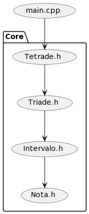
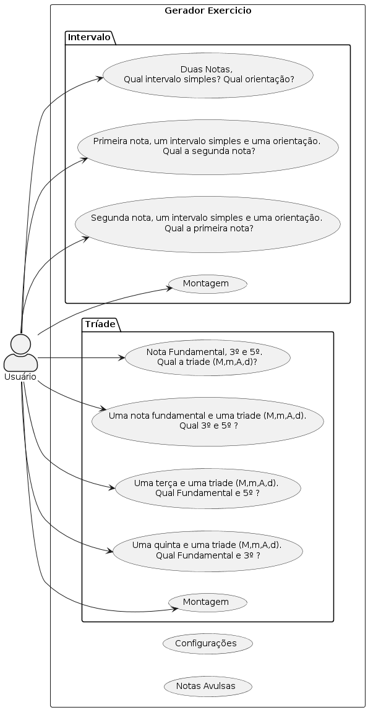

# Arquitetura



# Compilação

## Makefile

```
$ mkdir build
$ make
$ build/notas.sh  #executar
```

## CMake

```
$ mkdir build
$ cd build
$ cmake ..
$ make
$ ./notas.sh  #executar
```


# Motivação 
- Prover aos alunos e profesores da EMUFPA uma solução tecnológica com o intuido de auxiliar o aprendizado dos conteúdos ministrados sobre teoria musical na escola. 

# Possibilidades Funcionais



## Tipos de Intervalos Simples

- Uníssono
- 2m, 2M
- 3m, 3M
- 4J, 4A
- 5D, 5J
- 6m, 6M
- 7m, 7M
- 8J

## Tipos de Tríades

- Maior(M) - 3M + 3m
- Menor(m) - 3m + 3M
- Aumentado(A) - 3M + 3M
- Diminuto(d) - 3m + 3m

## Tipos de Tétrades

- Maior - MM, Mm, Md
- Menor - mM, mm, md
- Aumentado - AM, Am, Ad
- Diminuto - dM, dm, dd

# Funcionalidades
## Primerio Grupo
- Intervalos 
- Triades
- Opção de Dificuldade
  - Facil - randomizar notas sem acidentes
  - medio - randomizar notas com até 1 acidente (b ou #)
  - dificil - randomizar notas com até 2 acidente (bb ou *)
- Interação; com repecção de resposta, correção e avaliação

## Segundo Grupo
- Inversões de Triades
- Tétrades e suas inversões
- Cifras
  - Campo Harmônico Maior
  - Campo Harmônico Menor (Primitiva, Harmônica e Melódica)
- Intervalos Compostos

# Etapa de Desenvolvimento

1. Assegurar viabilidade do primeiro grupo de funcionalidades ainda em modo texto.
1. Determinar a forma de a solução/aplicação será "entrege" 
   1. Aplicação Desktop
   1. Aplicação Web
   1. Aplicação Mobile
1. Implementar o segundo grupo de funcionalidedes.

# Download plantuml jar

https://sourceforge.net/projects/plantuml/


# Pré-instalaçãoes

## ncurses

- https://en.wikipedia.org/wiki/Ncurses  
- `$ sudo apt install libncurses6-dev`

## gtkmm
- https://gtkmm.org
- `$ sudo apt install libgtkmm-3.0-dev`
- `$ sudo apt install libgtkmm-3.0-doc`

## glade
- https://github.com/GNOME/glade
- `$ sudo apt install glade`
